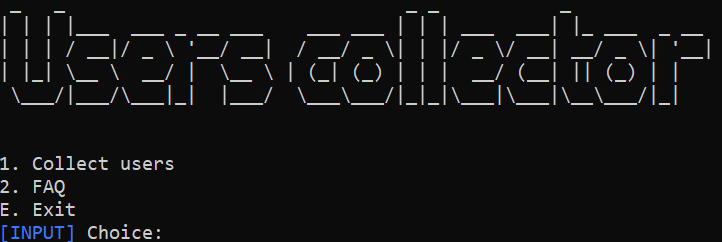
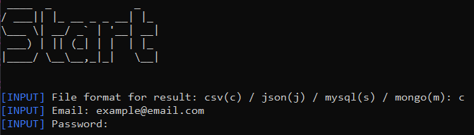

<!-- 
    Original template: 
    https://github.com/othneildrew/Best-README-Template/blob/master/README.md
-->

<a id="readme-top"></a>


<br />
<div align="center">
  <h3 align="center">Users collector</h3>

  <p align="center">
    Script to collect users in amino community
    <br />
    <br />
    <a href="https://github.com/Ptyg/collect_users_amino/tree/master/code">Code</a>
    |
    <a href="https://github.com/Ptyg/collect_users_amino/issues">Report Bug</a>
    |
    <a href="https://github.com/Ptyg/collect_users_amino/pulls">Request Feature</a>
  </p>
</div>


<p align="center">
  
</p>


<details>
  <summary>Table of Contents</summary>
  <ol>
    <li>
      <a href="#about-the-script">About the script</a>
      <ul>
        <li><a href="#built-with">Built With</a></li>
      </ul>
    </li>
    <li>
      <a href="#getting-started">Getting Started</a>
      <ul>
        <li><a href="#prerequisites">Prerequisites</a></li>
        <li><a href="#installation">Installation</a></li>
      </ul>
    </li>
    <li><a href="#usage">Usage</a></li>
    <li><a href="#contributing">Contributing</a></li>
    <li><a href="#license">License</a></li>
    <li><a href="#contact">Contact</a></li>
  </ol>
</details>


## About the script

As a leader, you need to make your community better and one of the most important topics - complex user data analysis: 

- How long users stay in the community?
- Which users create the most popular content?
- Which users level the most popular?
- etc

So, one of the first problems needs to be solved - how to collect as many users as possible? This script will help you with this problem.

Users will be collected from:
- from public chats
- from privite chats
- from wikis
- from blogs
- from leaderboard
- from leaders and curators
- from users` followers and following
- from online users
- from quizzes

<p align="right">(<a href="#readme-top">back to top</a>)</p>

## Built With

- [![Python][python-shield]][python-url]

<p align="right">(<a href="#readme-top">back to top</a>)</p>

## Getting Started

### Prerequisites

You need to have:

- Git: https://git-scm.com/download/
- Python: https://www.python.org/

And next system envs:
- [ _not necessary_ ] PATH - `{ path/to/git/cmd }` and `{ path/to/python.exe }`

### Installation

1. Create an empty directory wherever you want. It`s for repo cloning.

2. Clone the repo.
   ```sh
   git clone https://github.com/Ptyg/collect_users_amino.git
   ```

3. Open directory with cloned project in console.

4. Install packages.

    ```sh
    pip install -r "requirements.txt"
    ```

5. Run the script

    ```sh
    python main.py
    ```

<p align="right">(<a href="#readme-top">back to top</a>)</p>

## Usage

- After launch, you`ll see a window like this



- Before start collecting, you need to:   

    * choose saving type
    * enter login & password to login

  __P.s. Password input is hidden__ 



- Next you just need to follow the instructions

<p align="right">(<a href="#readme-top">back to top</a>)</p>


## Contributing

If you have a suggestion that would make this better, please fork the repo and create a pull request.

1. Fork the Project
2. Create your Feature Branch (`git checkout -b { branch_name }`)
3. Commit your Changes (`git commit -m 'Add an amazing feature'`)
4. Push to the Branch (`git push origin { branch_name }`)
5. Open a Pull Request

<p align="right">(<a href="#readme-top">back to top</a>)</p>

## License

Distributed under the BSD-3-Clause License. See `LICENSE.txt` for more information.

<p align="right">(<a href="#readme-top">back to top</a>)</p>

## Contact

Gtyp - gtyp_local@proton.me

Project Link: [https://github.com/Ptyg/collect_users_amino](https://github.com/Ptyg/collect_users_amino)

<p align="right">(<a href="#readme-top">back to top</a>)</p>

<!-- VARIABLES -->
[python-shield]: https://img.shields.io/static/v1?message=v%203.10&color=3776AB&logo=Python&logoColor=FFFFFF&label=Python
[python-url]: https://www.python.org/